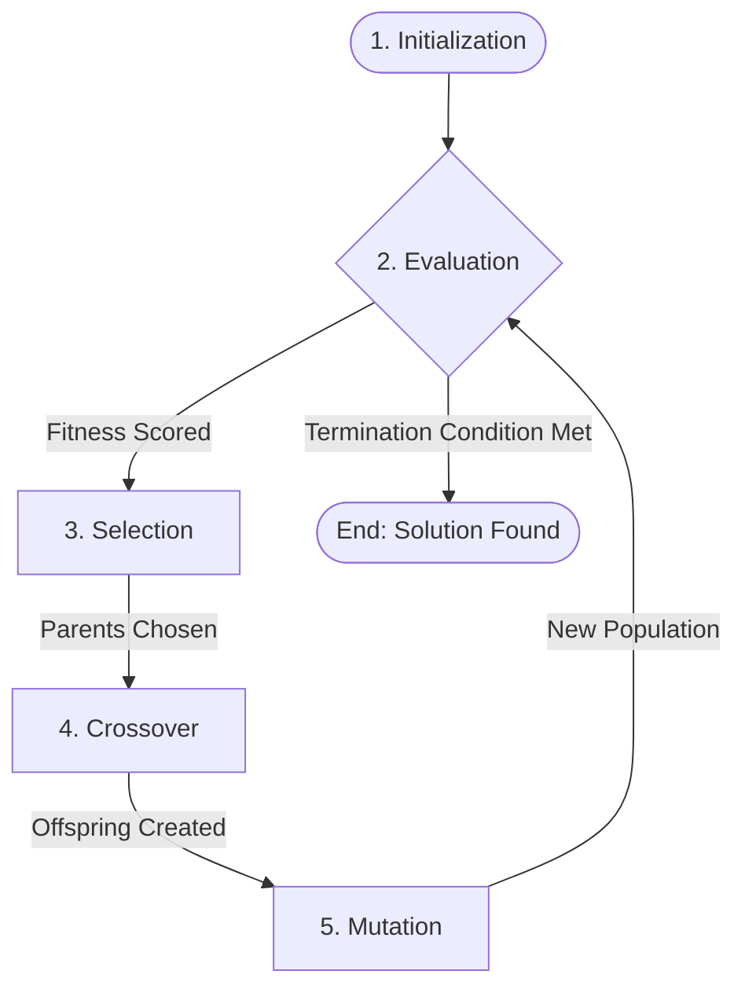

# Genetic Algorithms: A Comprehensive Handbook

> "I have called this principle, by which each slight variation, if useful, is preserved, by the term of Natural Selection." — Charles Darwin, *The Origin of Species*

## Table of Contents

1. [Chapter 1: The Biological Foundation](#chapter-1-the-biological-foundation)
2. [Chapter 2: The Evolutionary Cycle](#chapter-2-the-evolutionary-cycle)
3. [Chapter 3: Implementation Guide (Python & CUDA)](#chapter-3-implementation-guide-python--cuda)
4. [Chapter 4: The Genetic Operators](#chapter-4-the-genetic-operators)
5. [Chapter 5: Advanced Strategies](#chapter-5-advanced-strategies)

---

## Chapter 1: The Biological Foundation

### 1.1 Introduction

Nature has been solving complex optimization problems for billions of years. A **Genetic Algorithm (GA)** is a computational search heuristic inspired by this biological process of natural selection. It belongs to the larger class of **Evolutionary Algorithms (EA)**.

Unlike traditional algorithms that follow a strict set of deterministic steps (like binary search) to find a solution, GAs "evolve" a population of candidate solutions toward an optimal state using stochastic (random) operators. They are particularly effective when the search space is too large to explore exhaustively or when the "fitness" landscape is rugged and discontinuous.

### 1.2 Historical Context

The concept of using evolution as a computational process typically traces back to **Alan Turing** in 1950, who proposed a "learning machine" paralleling evolutionary principles. Experiments in "digital evolution" were conducted by **Nils Aall Barricelli** at the Institute for Advanced Study in Princeton in 1954.

However, the formal framework was established by **John Holland** in the 1970s at the University of Michigan (publication: *Adaptation in Natural and Artificial Systems*) and later popularized by his student **David Goldberg**, who demonstrated their application to complex engineering problems.

### 1.3 Core Concepts: Genotype vs. Phenotype

To implement a GA, one must first bridge the gap between the problem space and the genetic space.

| Concept | Biology | Computer Science (GA) | Example (String Evolution) |
| :--- | :--- | :--- | :--- |
| **Individual** | An organism (e.g., a person). | A single candidate solution. | One string: `"Hxllo Worjd"` |
| **Genotype** | The DNA/Chromosomes inside the cells. | The internal data representation. | Array of chars: `['H', 'x', ...]` |
| **Phenotype** | The physical traits (Blue eyes, Height). | The problem-specific expression. | The rendered text on screen. |
| **Fitness** | Ability to survive and reproduce. | A numeric score of "quality". | 9/11 characters correct. |

---

## Chapter 2: The Evolutionary Cycle

The power of a Genetic Algorithm lies in its iterative cycle. We create a "soup" of random DNA and force it to compete.

### 2.1 The Loop (Mermaid Diagram)



### 2.2 The Steps Explained

1. **Initialization**: We begin by generating a population of $N$ individuals with completely random DNA. At this stage, they are likely "garbage" solutions (e.g., `"zpqxr lkmne"`).
2. **Evaluation (Fitness Assignment)**: We pass every individual through a **Fitness Function**. This function is the "environment"—it judges how well the phenotype solves the optimization problem.
3. **Selection (Survival of the Fittest)**: We select parents for the next generation. High-fitness individuals have a statistically higher chance of being chosen, but low-fitness ones are not entirely excluded (to maintain diversity).
4. **Reproduction**:
    * **Crossover (Recombination)**: The "sex" of the algorithm. We combine the genetic code of two parents to produce a child. The hope is that the child inherits the *best* traits of both.
    * **Mutation**: The "chaos" of the algorithm. With a very low probability (e.g., 1%), we flip a bit or change a gene. This prevents the population from stagnating in local optima by exploring new areas of the search space.
5. **Termination**: The cycle repeats until we find a perfect solution ($Fitness = Max$) or reach a computational limit (e.g., 1000 generations).

### 2.3 Concrete Example: The "Shakespeare" Problem

Throughout this book, we will use a classic "Hello World" equivalent for GAs: **Evolving the string "To be or not to be"**.

* **Search Space**: If we have 27 possible characters (a-z + space) and a string of length 18, the total combinations are $27^{18} \approx 5.8 \times 10^{25}$. A brute force search would take eons to guess the correct string.
* **GA Approach**: A GA effectively "climbs" the hill of fitness. By keeping partial matches (like `"To be or..."`) and mutating the rest, it can typically find this string in a few hundred generations (milliseconds to seconds).

## Chapter 3: Implementation Guide (Python & CUDA)

### 3.1 The Problem: "String Evolution"

We will implement a Genetic Algorithm to evolve the target string **"To be or not to be"**.

* **Target**: `"To be or not to be"` (Length: 18)
* **Genes**: Printable ASCII characters.
* **Fitness Function**: Count of matching characters at the correct index. Max Fitness = 18.

### 3.2 Python Implementation

We'll use a standard Object-Oriented approach.

#### The DNA Class

```python
import random
import string

class Individual:
    def __init__(self, target_len):
        # Genotype: Random characters
        self.genes = [random.choice(string.printable) for _ in range(target_len)]
        self.fitness = 0

    def calculate_fitness(self, target):
        score = 0
        for i, char in enumerate(self.genes):
            if char == target[i]:
                score += 1
        self.fitness = score / len(target)  # Normalize 0.0 to 1.0

    def crossover(self, partner):
        # One-Point Crossover
        child = Individual(len(self.genes))
        midpoint = random.randint(0, len(self.genes))
        child.genes = self.genes[:midpoint] + partner.genes[midpoint:]
        return child

    def mutate(self, mutation_rate):
        for i in range(len(self.genes)):
            if random.random() < mutation_rate:
                self.genes[i] = random.choice(string.printable)
```

#### The Evolution Loop

```python
def genetic_algorithm():
    target = "To be or not to be"
    pop_size = 200
    mutation_rate = 0.01
    
    # 1. Initialization
    population = [Individual(len(target)) for _ in range(pop_size)]

    generation = 0
    while True:
        # 2. Evaluation
        for ind in population:
            ind.calculate_fitness(target)
        
        # Check for solution
        best_ind = max(population, key=lambda x: x.fitness)
        print(f"Gen {generation} | Best: {''.join(best_ind.genes)} | Fitness: {best_ind.fitness:.2f}")
        if best_ind.fitness == 1.0:
            break

        # 3. Selection (Mating Pool)
        pool = []
        for ind in population:
            # Add to pool more times if fitness is higher (Roulette Wheel concept)
            n = int(ind.fitness * 100)
            pool.extend([ind] * n)

        # 4. Reproduction
        new_population = []
        for _ in range(pop_size):
            parent_a = random.choice(pool)
            parent_b = random.choice(pool)
            child = parent_a.crossover(parent_b)
            child.mutate(mutation_rate)
            new_population.append(child)
            
        population = new_population
        generation += 1
```

### 3.3 CUDA & Parallel Concepts

Genetic Algorithms are **embarrassingly parallel**. This means the workload can be easily split into independent tasks without complex communication.

#### The Bottleneck

In the Python code above, the `calculate_fitness` loop runs sequentially:

```python
for ind in population:  # Runs on CPU, one by one
    ind.calculate_fitness(target)
```

If Population Size = 1,000,000, this takes a long time.

#### The GPU Approach (SIMT)

**SIMT (Single Instruction, Multiple Threads)** is the core of CUDA. We can launch thousands of threads, where each thread takes care of **one individual**.

* **Host (CPU)**: Manages the population array and mutation/crossover logic (or moves those to GPU too).
* **Device (GPU)**: Calculates fitness for all 1,000,000 individuals *simultaneously*.

#### CUDA Kernel Logic (Conceptual C++)

```cpp
__global__ void calculateFitnessKernel(char* population, char* target, float* fitnessScores, int popSize, int geneLength) {
    // Determine which individual this thread is responsible for
    int idx = blockIdx.x * blockDim.x + threadIdx.x;
    
    if (idx < popSize) {
        int score = 0;
        int myGeneStart = idx * geneLength;
        
        // Calculate fitness for this specific individual
        for (int i = 0; i < geneLength; i++) {
            if (population[myGeneStart + i] == target[i]) {
                score++;
            }
        }
        
        // Write result to global memory
        fitnessScores[idx] = (float)score / geneLength;
    }
}
```

By offloading the evaluation step to the GPU, we can scale populations to millions, which speeds up convergence for complex problems.

## Chapter 4: The Genetic Operators

There is no single "correct" way to implement Evolution. The choice of operator depends entirely on your data representation (Binary, Real-Valued, or Ordered).

### 4.1 Selection Strategies

Selection dictates which individuals get to reproduce. It balances **Exploration** (maintaining diversity) and **Exploitation** (focusing on the best).

| Method | Mechanism | Pros | Cons |
| :--- | :--- | :--- | :--- |
| **Roulette Wheel** | Parents are chosen with probability proportional to their fitness ($P_i = f_i / \Sigma f$). | Simple to implement. | **Premature Convergence**: Super-fit individuals dominate too early. |
| **Tournament** | Select $k$ individuals at random; the fittest wins. | Adjustable pressure (via $k$); easy to parallelize. | Selection pressure depends entirely on tournament size $k$. |
| **Rank Selection** | Individuals are ranked; probability is based on rank (1st, 2nd...) not raw score. | Prevents super-fit domination; keeps pressure constant. | Discards information about the *magnitude* of fitness differences. |
| **Stochastic Universal Sampling (SUS)** | Uses multiple equally spaced pointers to select $N$ parents in one "spin". | Zero bias; ensures exact proportional representation. | Slightly more complex to state than Roulette. |

### 4.2 Crossover Operators (Recombination)

Crossover combines traits from parents.

#### Binary / String Crossover

* **One-Point**: Split string at random index $k$. Child gets Parent A's head and Parent B's tail.
* **Uniform**: For every gene, flip a coin to decide if it comes from Parent A or Parent B. Good for preserving "building blocks" that are not contiguous.

#### Permutation Crossover (Ordered Problems like TSP)

If the chromosome is a sequence of unique cities, standard crossover would create duplicates (invalid tours).

* **PMX (Partially Mapped Crossover)**: Maps a sub-segment from Parent 1 to Parent 2 and resolves conflicts to preserve adjacency.
* **OX1 (Order Crossover)**: Copies a segment from Parent 1, then fills the remaining slots with Parent 2's cities *in the order they appear*. Preserves relative order.

### 4.3 Mutation Operators

Mutation introduces new genetic material to preventing the population from stagnating.

* **Bit Flip** (Binary): Invert a 0 to 1.
* **Gaussian** (Real-Valued): Add a random number from a normal distribution ($N(0, \sigma)$).
* **Swap** (Permutation): Pick two cities and swap them.
* **Inversion** (Permutation): Reverse a section of the tour (e.g., A-**B-C-D**-E $\rightarrow$ A-**D-C-B**-E). This is extremely effective for TSP as it uncrosses paths.

---

## Chapter 5: Advanced Strategies

### 5.1 Memetic Algorithms (Hybridization)

A standard GA is great at finding the "general area" of a solution (Global Search) but can be slow to refine the final details (Local Search).
A **Memetic Algorithm** combines GA with a local heuristic.

* **Process**: After mutation, apply a local search (like Hill Climbing) to every individual to reach the nearest local peak.
* **Example**: In TSP, apply **2-opt** (un-crossing edges) to every child before evaluating fitness.

### 5.2 Speciation & Niching

Standard GAs tend to converge to a single solution. **Speciation** forces the population to maintain diverse sub-populations ("species") that occupy different peaks in the fitness landscape.

* **Fitness Sharing**: Reduces the fitness of individuals that are too similar to others (punishes "crowding").
* **Island Models**: Split the population into isolated "islands". Individuals evolve independently and occasionally "migrate" to other islands. This preserves unique genetic evolutionary paths.

### 5.3 Limitations

| Problem Type | Limitation | Better Alternative |
| :--- | :--- | :--- |
| **Differentiable Functions** | If you know the gradient (slope), random guessing is inefficient. | **Gradient Descent** (Backpropagation). |
| **Simple Unimodal** | If there is only one peak. | **Simulated Annealing** or **Hill Climbing**. |
| **Expensive Fitness** | If checking fitness takes 1 hour. | **Surrogate Optimization** (Use AI to predict fitness). |

---

## Conclusion

Genetic Algorithms are a powerful, flexible tool for black-box optimization. While they are not always the fastest method, their ability to handle discrete, non-differentiable, and complex search spaces makes them an essential tool in Artificial Intelligence.
